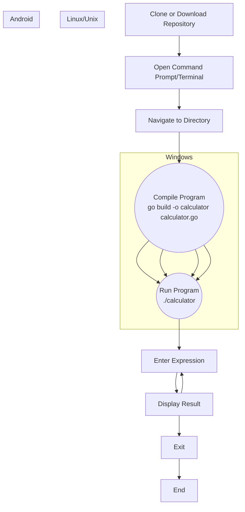

<center><h1>Simple Calculator</h1></center>

**Simple Calculator**

This is a simple command-line calculator written in Go. It evaluates arithmetic expressions provided by the user.

---

**Usage**

1. **Windows** :
   * Clone or download this repository.
   * Open a command prompt or terminal.
   * Navigate to the directory containing the`calculator.go` file.
   * Compile the program to create an executable file:`go build -o calculator.exe calculator.go`
   * Run the compiled executable:`./calculator.exe`
   * Enter expressions in the format`number1 operator number2`, e.g.,`10 + 5`, and press Enter.
   * The calculator will display the result of the expression.
2. **Other Operating Systems (Linux, Unix)** :
   * Follow the same steps as for Windows, replacing`calculator.exe` with just`calculator` in the commands.
3. **Android (Termux)** :
   * Install Termux from the Google Play Store.
   * Open Termux and install Go:`pkg install golang`
   * Clone or download this repository into your Termux environment.
   * Navigate to the directory containing the`calculator.go` file.
   * Compile the program:`go build -o calculator calculator.go`
   * Run the program:`./calculator`
   * Enter expressions in the format`number1 operator number2` and press Enter.

---

**How to Use**

1. Run the compiled executable as per the instructions above.
2. Enter expressions in the format`number1 operator number2` and press Enter.
3. The calculator will display the result of the expression

This is a simple command-line calculator written in Go. It evaluates arithmetic expressions provided by the user.

---

**Example**

```sh
$ ./calculator.exe
Simple Calculator
Enter an expression (e.g., 10 + 5): 10 * 3
Result: 30
Enter an expression (e.g., 10 + 5): 25 / 5
Result: 5
Enter an expression (e.g., 10 + 5): exit
```

---

**Notes**

* Supported operators: +, -, *, /
* Press`Ctrl+C` to exit the calculator.


